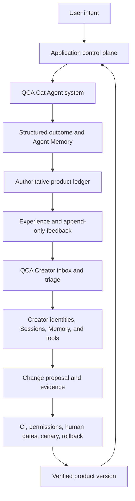
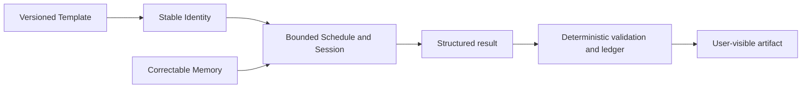
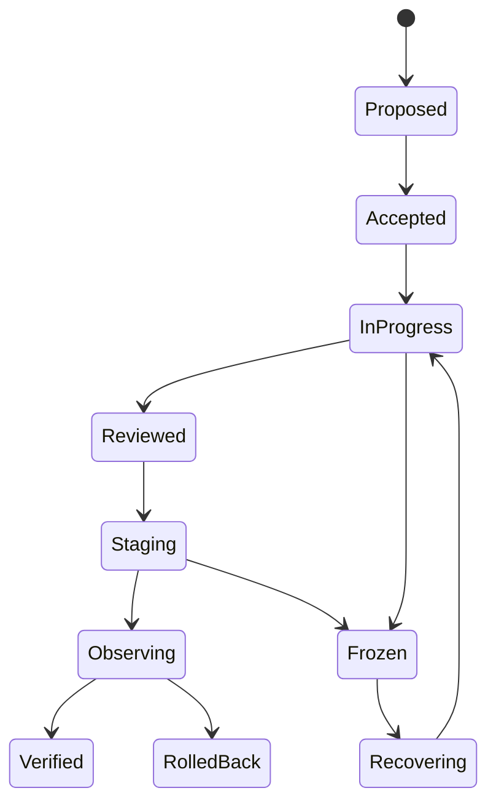
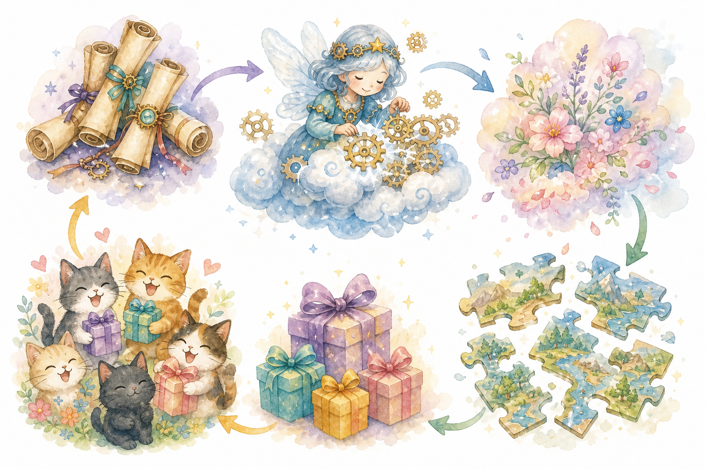

What changes when an Agent is not an assistant added to a product, but the engine of both the product and the system that improves it? [Me&Me · 我&猫](https://littlememeworld.com) explores that question with two connected Qoder Cloud Agent (QCA) systems. A persistent Cat Agent faces the user, travels while the user is away, remembers experience, and returns artifacts. A Creator Agent system faces feedback, the repository, tests, and the software lifecycle.

The transferable pattern is **two loops, one product**. Both loops use long-running QCA resources, versioned task definitions, Sessions and Memory where appropriate, tools, and isolated execution. Their authority is different. Deterministic application controls govern the Cat's externally visible effects; CI, permission policy, human approval, canaries, observation, and rollback govern the Creator's changes. Those controls constrain the Agents. They do not replace the reasoning and work performed by either Agent system.

This article separates three kinds of claims. The inspected Me&Me repository contains an implemented Cat/Forward pattern and concrete Creator inbox, task, and governance patterns. The Me&Me target architecture runs both the Cat and Creator on QCA; some recurring Creator, real-credential, end-to-end, and production rollout work was still incomplete in the inspected snapshot. The recommendations below generalize the architecture for other QCA products rather than presenting every target-state detail as already deployed.

## Use cases and boundaries

Use the Agent-as-engine pattern when users expect an identity to persist across days, work to continue on a schedule or event, and results to become visible, auditable product artifacts. It is especially useful when the product must support pause and resume, repair, credential rotation, behavior versioning, or continuity across Sessions. Research analysts, account agents, repository agents, and learning companions can all use this shape; the cat is only one product expression.

Add the evolution loop when feedback and runtime outcomes should improve future behavior or software versions, and when the team already has measurable outcomes plus a safe release path. A one-shot, read-only prompt with no persistent identity or side effect does not need this architecture. Nor should a team automate self-evolution before it can test, observe, freeze, and roll back changes.

Keep capability separate from authority:

| Concern | QCA Agent may do | Deterministic system or human must own |
|---|---|---|
| Product behavior | Interpret context, select a route, create artifacts, summarize experience | Authentication, business rules, unique side effects, user-visible status |
| Memory | Maintain narrative continuity, preferences, and useful interpretation | Corrections, deletion, privacy policy, authoritative facts |
| Scheduling | Execute work when triggered | Eligibility, idempotency, concurrency, budgets, circuit breaking |
| Software evolution | Collect, cluster, propose, implement, test, and review evidence | Change-class policy, merge, production approval, destructive operations |

“Self-evolving” is not permission for one super-Agent to change production after reading a comment. Memory is not a product database; a prompt is not an authorization policy or a distributed lock. Cat credentials must not flow into Creator work, and repository history must not acquire secrets or raw user data merely because an Agent can read feedback. The goal is bounded autonomy with inspectable evidence, not unrestricted mutation.

## Recommended approach

### Design two loops with separate governance planes

The inner loop produces user value. The outer loop turns product evidence into a verified change and feeds that change back into the inner loop. Connect them through structured evidence, not shared unlimited authority.

The Cat cannot approve software changes. The Creator cannot inherit a user's Cat identity, Memory, or credentials. Each system gets its own Templates, identities, task sources, tools, permissions, budgets, and execution boundary.

### Build the Cat as a resource contract

Treat Agent provisioning as a versioned application contract rather than a sequence of ad hoc API calls.

| Resource | Responsibility | Lifecycle rule |
|---|---|---|
| Canonical Template | Shared tools, environment, and baseline task behavior | Keep in version control; record the applied version |
| Identity | Stable per-user or per-entity Agent identity | Derive from a stable application ID; do not recreate per run |
| Identity Config | Personality, model, and instance policy | Update independently; record successful application |
| Schedule | Event or time trigger | Bound concurrency, attempts, timeout, and pause state |
| Session | Execution continuity | Reuse deliberately; recreate for an intentional boundary change |
| Memory | Preferences, history, and interpretation | Scope to one identity; make correctable; never treat as final truth |
| Narrow token | Access to Agent-facing application endpoints | Rotate server-side; deny unrelated services and operations |

In the inspected Me&Me implementation, ensure-style provisioning establishes stable Forward resources, a schedule can reuse a bounded Session, and a narrow token limits the Cat to the intended world-reading and travel-reporting surface. The application still validates each report before it becomes a product fact.

The runtime model is intentionally asymmetric: the Agent owns open-ended behavior, while the application owns eligibility and effects.

Before a run, check that the identity is active, the owner is authorized, the Template version is allowed, dependencies are ready, concurrency and budget remain, an idempotency key has been acquired, and the circuit state permits work. After a run, validate referenced entities, business date, numerical limits, duplicates, and authorization before applying one transaction. A timeout, malformed result, or duplicate delivery must produce a truthful terminal state rather than a second side effect.

Memory should support continuity—preferences, a journal, impressions, or a compact operating summary. The authoritative ledger should hold ownership, consent, balances, lifecycle state, and irreversible actions. Define a correction path: update the ledger first, then rebuild or annotate Memory. This prevents an evocative narrative from silently overriding user-controlled truth.

### Make feedback an append-only Creator inbox

Give every feedback item an immutable identifier, source time, sanitized body, and intake status. The inbox task may fetch a bounded batch, deduplicate it, write an append-only record, acknowledge receipt, and create or update a work item. It must not rewrite the original request or expose confidential data to repository history. Keep user-facing states such as received, under review, accepted, declined, shipped, and verified distinct from internal Agent narration.

Append-only intake makes retries safe and lets the Creator reason over provenance rather than an ever-changing blob. It also creates the bridge between the two loops: product outcomes and user feedback become inputs, while repository and deployment evidence return as traceable status.

### Run the Creator as a QCA Agent system

The Creator is itself a first-class QCA Agent system—not a CI script with an Agent label. Define it with versioned Templates and repository-owned task definitions, separate stable Identities for its roles, bounded Schedules and Sessions, scoped Memory, least-privilege tools, isolated execution, explicit permissions, and structured evidence outputs.

| QCA resource | Creator mapping and boundary |
|---|---|
| Template and task | Versioned role instructions plus acceptance criteria; record the source revision |
| Identity | Separate stable identities for intake, implementation, review, release, and monitoring |
| Schedule or long-running task | Trigger bounded inbox, triage, health, or maintenance work; deterministic policy decides eligibility |
| Session | Bound to one batch, work item, exact review revision, release, or observation window |
| Memory | Store role playbooks and non-sensitive continuity; keep repository, backlog, commit, CI, and approval state authoritative |
| Tools and isolation | Grant only required repository, test, artifact, deployment, or observability actions in a clean sandbox or worktree |
| Permissions and outputs | Enforce least privilege and require identifiers, revision, tests, artifacts, review, deploy, and observation evidence |

Use role separation even if one QCA account hosts the system. An inbox identity collects and sanitizes signals. A development identity receives one accepted item and works in an isolated checkout. A review identity examines the exact revision and cannot alter it. A release identity can act only on an approved immutable bundle. A monitor identity gathers health evidence and can request a narrow rollback or freeze. No identity approves its own work, and production approval remains a human or deterministic policy decision.

Classify every change before tools are granted. A practical scale is L0 for data-only changes, L1 for versioned configuration, Templates, tasks, or documentation, L2 for code, migrations, or runtime behavior, and L3 for governance or security boundaries. The highest affected level wins. Higher levels require stronger review, broader tests, smaller canaries, and more explicit human approval.

The Creator's state machine must stop as clearly as it starts:

Every transition should emit structured evidence: proposal and task IDs, task version, identity and Session reference, branch and exact revision, test results, artifacts, independent review, deployment reference, observation window, and final status. Missing evidence means incomplete, not “probably successful.” A freeze state blocks new implementation and release Sessions while preserving evidence for recovery.

### Roll out in thin slices

Start with one measurable Cat outcome and two narrow application endpoints. Add the authoritative ledger, validation, idempotency, and circuit state before scheduling. Then add stable Identity, versioned Template, bounded Session reuse, correctable Memory, pause and repair, and token rotation.

For the outer loop, begin with append-only inbox and visible statuses. Define Creator tasks and separate identities, but run one accepted work item manually through isolated implementation, exact-revision review, tests, and evidence capture. Schedule only inbox and triage after those runs are repeatable. Add staging, canary, observation, rollback, and freeze before automating higher-risk changes. Autonomy should expand because evidence supports it, not because the prompt sounds confident.

## Validation and maintenance

Validate the Cat loop with drills, not only happy-path demos. Trigger two deliveries with the same idempotency key and confirm one ledger entry. Pause the identity or schedule and confirm no work starts. Rotate the narrow token and verify the old one fails without losing product history. Corrupt or delete an Agent-side resource in a test environment and confirm repair restores the intended version. Submit a malformed report and confirm it creates no partial side effect. Correct a user fact and verify both the authoritative ledger and regenerated Memory converge.

Exercise the Creator loop with the same discipline. Re-ingest an existing feedback item and confirm no duplicate work item. Make the implementation Session exceed its budget and confirm it stops with partial evidence. Give review an old revision and ensure the mismatch blocks approval. Fail a required test, omit an artifact, or exceed the change level's permission set and confirm the state cannot advance. Fail a canary health check and rehearse rollback; invoke freeze and verify that queued releases cannot bypass it.

For both loops, retain run identity, Template/task version, Session reference, start and end times, status, retry count, idempotency key, tool decisions, validation results, and cost or resource usage. Creator records additionally need the proposal, branch, exact revision, CI and review results, immutable bundle, deployment, observation, and rollback references. Evidence should be useful without containing prompts, credentials, or private user content.

Track product outcomes separately from system health. Cat metrics include completion and valid-report rates, duplicate suppression, time to artifact, repair rate, and user correction rate. Creator metrics include feedback-to-triage time, accepted-to-reviewed time, evidence completeness, escaped regressions, rollback rate, and time frozen. Cost and latency matter in both loops, but neither substitutes for outcome quality.

Finally, review permissions and versions on a schedule. Remove unused tools, rotate credentials, compare deployed Template and task versions with their repository sources, audit identities and active Schedules, sample evidence chains, and rehearse rollback and freeze. This operating rhythm keeps both QCA Agent systems useful while preserving the deterministic boundary that makes their autonomy safe.
