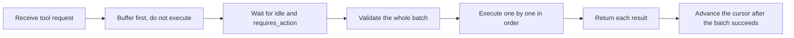

> This language version was automatically translated by AI.

## Use cases and boundaries

Suppose you already have a task-dispatch system—one that hands work to different coding Agents. Now you want to "hire" one more: let it run code in a cloud sandbox while also reading and writing tickets in your system, changing their status, and leaving comments, like a real team member.

That is what it means to wire Qoder Cloud in as a runtime. It can do work in both directions: on one side, the built-in Bash and file tools run inside a cloud-managed sandbox (in my own testing it wrote a Python script itself, ran it, and pasted the output back, all inside a cloud container without touching a single hair on my local machine); on the other side, you hand it your own business capabilities as "custom tools"—when it wants to look up a ticket, it sends a request, your process performs one allowlisted operation, and then stuffs the result back into the same session.

I actually put it through multiple turns: writing files, running commands, resuming a session to continue from the previous turn's context, and canceling midway. The cloud-sandbox half really is worry-free—you don't maintain the runtime yourself.

But there is one boundary to make clear up front, or you will build the wrong expectations: **the cloud Bash and file tools run inside a managed container and cannot reach your host machine, your code checkout, or your local file system.** Do not expect it to operate on your local things directly—it is just an isolated sandbox.

The other boundary is the one you draw yourself: the allowlist for custom tools is a hard gate. Only expose the handful of operations you have thought through, can validate, and can audit when something goes wrong; reject everything else. Support the clearly defined scenarios first (a single ticket, a conversation); do not rush to open up batch, scheduled, or multi-Agent surfaces whose boundaries you have not yet worked out—leave those until you have a dedicated schema and lifecycle handling.

## Recommended approach

Wiring this up comes down to just three real challenges: **recovering after a drop, keeping the protocol disciplined, and not letting tokens cross over.**

| Decision | Recommended way | Reason |
|---|---|---|
| Event transport | Consume SSE, remember the latest event ID, resume with `Last-Event-ID` after a drop, and dedupe by ID | A network hiccup won't lose events or cause duplicate processing |
| Requests with side effects | Attach an idempotency key and retry only limited times on 429/5xx | Retries won't do the same thing twice |
| A batch of custom tools | Wait until the session is idle and `stop_reason=requires_action` to reveal the whole batch, validate the batch first, then execute one by one | No "half done" state; a problematic batch is stopped before you act |
| Returning results | Send each result back to the session; advance the cursor only after the whole batch succeeds | Reconnect-and-replay can resend results that didn't arrive, but won't re-run a data-changing tool |
| Fallbacks | Treat unknown actions, empty batches, reaching a terminal state with work unfinished, and tools requiring human authorization all as failures | When in doubt, reject |
| Tokens | The cloud PAT lives only in the cloud API client; the business task token is obtained separately | The task token never enters cloud requests, prompts, tool inputs/outputs, or logs |

The part that is easiest to get wrong—and most worth drawing—is the execution sequence for custom tools. The cloud does not execute a tool request the moment it is sent to you—it first gathers all the tools for this turn, and only when it is idle and declares `requires_action` does it reveal the whole batch:

Why go the long way around? Because it makes "exactly once" possible. Each tool's result is cached once executed, so if SSE drops and reconnects, or a result is sent but its acknowledgment never arrives, on replay you resend the **cached result** rather than executing that data-changing tool again. Changing a ticket status once versus twice is a big difference.

Don't go soft on validation: accept only the fixed tool names on the allowlist, reject even one extra JSON field, and check values, lengths, and task scope one by one. A single ticket task can only touch the ticket it was assigned to—even if the cloud model gets a hot head and requests to change a different ticket, this wall stands inside your own process, and it cannot get past.

## Validation and maintenance

For this kind of bridge, "it worked once" doesn't count; it must be guarded by **deterministic tests you can run repeatedly and that cover all sorts of bad situations**. Smoke tests against the real cloud are a supplement, not the main force.

- **Exercise the whole protocol with a mock server.** Creating a session, sending messages, the SSE stream, the whole-batch `requires_action`, returning results, and resuming after a drop—cover all of it with a local fake server. Running it isn't enough; turn on race detection—concurrency problems are invisible without it.
- **Deliberately manufacture a "failure midway."** The first result succeeds, the second returns 503 and then reconnects—at that point what you must verify is: the replay resends only the one that didn't arrive, and never re-runs a data-changing tool that already succeeded. If you don't manufacture this scenario on purpose, normal testing will never cover it.
- **Verify the fallbacks one by one.** Unknown action IDs, empty batches, and reaching idle before tools finish executing—these should all be judged failures, not waved through as successes.

On maintenance, there's one line I want to put in the most visible place: **don't hype "exactly once" as bigger than it can actually guarantee.** In-process exactly-once holds only while this process is alive. A process crashing and restarting, or a result that was sent and received by the cloud but not recorded locally—these cross-process, reconciliation-requiring situations are homework you must do yourself when connecting to a real system. Writing it into the docs as a known boundary is far more honest than pretending it is already solved, and it saves the next person from tripping over it.

## Optional: Demo source

The Demo is a small, pure Go standard-library, zero-dependency module that implements the whole setup above in a runnable form: an allowlist dispatcher, the `requires_action` whole-batch protocol, and an SSE reader that resumes after a drop. The tests specifically include the "reconnect after a 503 midway, replay without re-execution" scene. How to run it is in the README; `go test` shows the results directly.

[View the Demo source](https://github.com/QoderAI/cloud-agents-cookbook/tree/main/demos/integrate-qoder-cloud-runtime)
