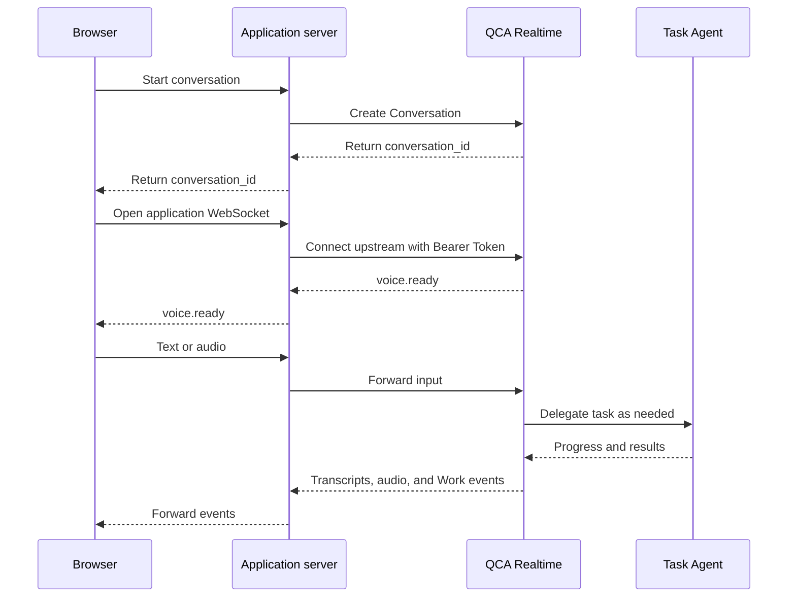

> This language version was automatically translated by AI.

## Goal and use case

This recipe adds real-time voice to a Web application with an existing Forward Template:

- The voice Agent handles conversation and explains results.
- The task Agent executes tasks using the Template's tools and runtime.

| Concept | Purpose |
| --- | --- |
| Identity | The application user's identity in Forward, associated when creating a Conversation |
| Template | The task Agent's model, instructions, tools, and runtime configuration |
| Conversation | A voice conversation that can be reconnected to; the application should save its ID |
| Work | A delegated background task, with progress and results reported through `work.*` events |

The browser uses the application server to create conversations and exchange real-time events. The server authenticates upstream connections:



Before you start:

- Credentials and resources: a PAT or SAT, Identity, and Template in the same environment. Exchange a Service Account Key for an SAT first.
- Runtime: a Template with tool permissions and a runtime that can complete the target task.
- Application: a server with WebSocket support, a browser with microphone and Web Audio support, and HTTPS for the deployed page.
- Example tools: curl and Node.js. The application server can use any language.

Realtime is in Beta. Model, sandbox, and tool usage is billed under the applicable pricing rules.

## Steps

The [official Quickstart](https://github.com/QoderAI/forward-quickstart) provides a complete integration example.

### Step 1: Create a Conversation

Create the Conversation from the application server. The following curl example shows the request format; replace the placeholders with your credentials and resource IDs:

```bash
export QODER_ACCESS_TOKEN="<PAT or SAT>"
export IDENTITY_ID="<Identity ID>"
export TEMPLATE_ID="<Template ID>"
export FORWARD_BASE_URL="https://api.qoder.com.cn/api/v1/forward"
export IDEMPOTENCY_KEY="$(node -e 'console.log(crypto.randomUUID())')"

curl --silent --show-error --fail-with-body \
  -X POST "$FORWARD_BASE_URL/realtime/conversations" \
  -H "Authorization: Bearer $QODER_ACCESS_TOKEN" \
  -H "Content-Type: application/json" \
  -H "Idempotency-Key: $IDEMPOTENCY_KEY" \
  --data @- <<EOF_REQUEST
{
  "identity_id": "$IDENTITY_ID",
  "template_id": "$TEMPLATE_ID",
  "title": "Realtime integration check",
  "config": {"audio": {"output": {"voice": "longanqian"}}}
}
EOF_REQUEST
```

For the Global environment, use `https://api.qoder.com/api/v1/forward`. Credentials and resources must belong to the same environment.

A successful request returns HTTP 201. Example response fields:

```json
{
  "id": "conv_xxx",
  "type": "voice.conversation",
  "status": "ready",
  "config": {"audio": {"output": {"voice": "longanqian"}}}
}
```

- Save the returned `id`, associate it with the application user, and use it as `conversation_id` in subsequent requests.
- Reuse the same idempotency key and request body when retrying a creation request.
- The voice is fixed at creation. Create a new Conversation to change it.

See [Create a Conversation](https://docs.qoder.cn/cloud-agents/forward-realtime-create-conversation) for the full parameter reference.

### Step 2: Establish a WebSocket connection

Connect from the server to the following address, with an `Authorization: Bearer` credential in the handshake headers:

```text
wss://api.qoder.com.cn/api/v1/forward/realtime?conversation_id=conv_xxx
```

The browser's native WebSocket API cannot set an Authorization header. Quickstart uses a same-origin relay at `/api/voice/socket` and sends an authentication message after connecting:

```json
{
  "type": "proxy.auth",
  "pat": "<PAT or SAT used to sign in>",
  "environment": "cn-prod",
  "conversation_id": "conv_xxx"
}
```

- `proxy.auth` is part of Quickstart's relay protocol. The relay handles it before connecting upstream.
- The Global upstream domain is `api.qoder.com`.
- Wait for the upstream `voice.ready` event before sending input. The browser's `open` event only confirms the relay connection.

See [voiceProxy.ts](https://github.com/QoderAI/forward-quickstart/blob/339bfc09f307064051161e124fa5d9f1099ec491/server/src/voiceProxy.ts) for the relay implementation.

Quickstart signs in with developer credentials. For an application serving end users, the server should:

- Manage upstream credentials and verify Conversation ownership.
- Restrict allowed Origins and upstream addresses.
- Avoid sending long-lived credentials to the browser or writing tokens to URLs or logs.

### Step 3: Send text and receive transcripts

After `voice.ready`, send a WebSocket text message:

```json
{
  "version": "voice.realtime.v1",
  "type": "text.message",
  "payload": {"text": "Hello, please introduce yourself in one sentence."}
}
```

- `transcript.delta`: update the interim transcript.
- `transcript.final`: replace the interim transcript for the same message with the final text.
- `audio.delta` and `audio.done`: receive response audio, as described in the next step.

For connections, heartbeats, and retries, see Quickstart's [VoiceConnection](https://github.com/QoderAI/forward-quickstart/blob/339bfc09f307064051161e124fa5d9f1099ec491/client/src/voice/voiceConnection.ts).

### Step 4: Send and receive audio

Once text interaction works, add audio capture and playback. See [voiceAudio.ts](https://github.com/QoderAI/forward-quickstart/blob/339bfc09f307064051161e124fa5d9f1099ec491/client/src/voice/voiceAudio.ts) and [useVoiceSession.ts](https://github.com/QoderAI/forward-quickstart/blob/339bfc09f307064051161e124fa5d9f1099ec491/client/src/voice/useVoiceSession.ts).

| Direction | Current format | Client processing |
| --- | --- | --- |
| Microphone input | 16 kHz, mono, little-endian PCM16 | Resample captured audio, convert to PCM16, then Base64-encode |
| Agent output | 24 kHz, mono, little-endian PCM16 | Decode Base64, convert to samples playable by Web Audio, and queue in order |

- Use the formats reported in `voice.ready.payload.input_audio` and `output_audio`.
- Send raw PCM without a file header, Base64-encoded inside a JSON text message.
- Each client message, including JSON and Base64, must not exceed 256 KiB.

See [Connect to a Conversation](https://docs.qoder.cn/cloud-agents/forward-realtime-connect) for the full protocol.

This example reuses Quickstart's `MicrophoneCapture` and belongs in its `client/src/voice/` directory. Call it from a start button and handle permission failures in the caller:

```typescript
import { MicrophoneCapture } from './voiceAudio';
import type { VoiceConnection } from './voiceConnection';

export async function startMicrophone(connection: VoiceConnection) {
  const microphone = new MicrophoneCapture();
  await microphone.start((audio) => {
    if (connection.ready) connection.send('audio.append', { audio });
  });
  return microphone;
}
```

Handle playback and acknowledgments in this order:

1. Queue `audio.delta` and send `playback.started` when playback begins.
2. After `audio.done` and the queue has finished playing, send `playback.ended`. Send `playback.cancelled` if playback is canceled.
3. Copy the audio event's `work_id` and `announcement_id` unchanged into the acknowledgment `payload`. Use `{}` if neither is provided.

Quickstart's `AudioPlayback` and `handleVoicePlaybackEvent` implement this logic.

### Step 5: Execute tasks and show progress

Use a Template with a code execution tool and runtime. Request a task through voice or `text.message`:

> Run Python in the runtime to calculate the sum of the squares of the integers from 1 to 100. Tell me the result and the code you ran.

Check the result, `338350`, and the tool execution record to confirm that the task ran.

Update task state using the event's top-level `work_id`:

| Event | UI update |
| --- | --- |
| `work.accepted` | Show the accepted task goal |
| `work.running` | Mark the task as running |
| `work.progress` | Show progress such as tool execution; also check for errors |
| `work.milestone` | Show an intermediate summary |
| `work.completed` | Mark the task as complete and show `payload.result` |
| `work.failed` | Mark the task as failed or canceled and show `payload.error.code` |

- Track connection state and task state separately.
- `work.completed` means task execution has finished; the spoken result may still be playing.
- Ordinary conversation does not always create Work.

### Step 6: Manage the connection

#### Interrupt

1. Send `interrupt` when the user requests an interruption.
2. Stop local playback, clear the queue, and send `playback.cancelled` for canceled announcements.

Apply step 2 when the server sends `playback.interrupt`. Interrupting playback does not automatically cancel background tasks.

#### Reconnect

- Reuse the original `conversation_id`, authenticate again, and resume input after `voice.ready`.
- Restore the UI from history without resubmitting tasks. `sequence` resets on reconnection and cannot be used as a history replay cursor.
- Use backoff for retryable disconnections. Quickstart waits 1, 2, and 4 seconds; honor a longer delay if the server specifies one.
- Stop retrying after an authentication failure, an intentional close, or `voice.replaced`.

Audio interrupted by a disconnection is not guaranteed to resume.

#### End the call

1. Stop audio capture and playback.
2. Send `connection.close` with a unique `request_id`.
3. Disconnect after receiving the matching `connection.closed`. On timeout, report the error and release resources.

Using the current call instances in Quickstart:

```typescript
await Promise.allSettled([microphone.stop(), playback.cancel()]);
try {
  await connection.closeGracefully();
} finally {
  connection.disconnect();
}
```

Ending the call does not automatically cancel background tasks. Cancel them separately if needed.

## Verification

Verify each item after integration:

| Check | Action | Pass condition |
| --- | --- | --- |
| Conversation creation | Retry creation with the same idempotency key and body | The same Conversation ID is returned |
| Connection readiness | Establish the real-time connection | Receive `voice.ready` for that Conversation |
| Text interaction | Request a short self-introduction | Receive the final transcript; a complete voice UI can play the response |
| Voice input | Speak into the microphone | See the recognized input and receive a response |
| Task execution | Request the sum-of-squares calculation | See Work progress, a successful terminal state, and a verifiable execution result |
| Playback interruption | Interrupt during playback | Old audio stops immediately and queued audio does not continue |
| Connection recovery | Disconnect the network briefly, then restore it | Reconnect with the original ID and become ready without creating duplicate tasks |
| Call termination | End the call | Receive the matching close acknowledgment and release the microphone |

After testing, stop development services and clean up test resources. After deployment, verify audio input, output, and reconnection on the actual domain.

## Common questions

### Why can I not send messages after creating a Conversation?

Check the relay and upstream connections. Wait for `voice.ready` before sending input.

### What should I check after a 401 or 403 response?

Check the credential type, expiration, environment, and resource permissions. An Identity-scoped SAT can only access its associated Identity.

### Why does text work but no audio play?

Check for `audio.delta`, the decoding format, a suspended AudioContext, the playback queue, and mute settings.

### Why does the voice Agent respond without executing Python?

Verify the Template's code execution capability in a regular Forward conversation first. Then check Realtime Work events and tool execution errors.
