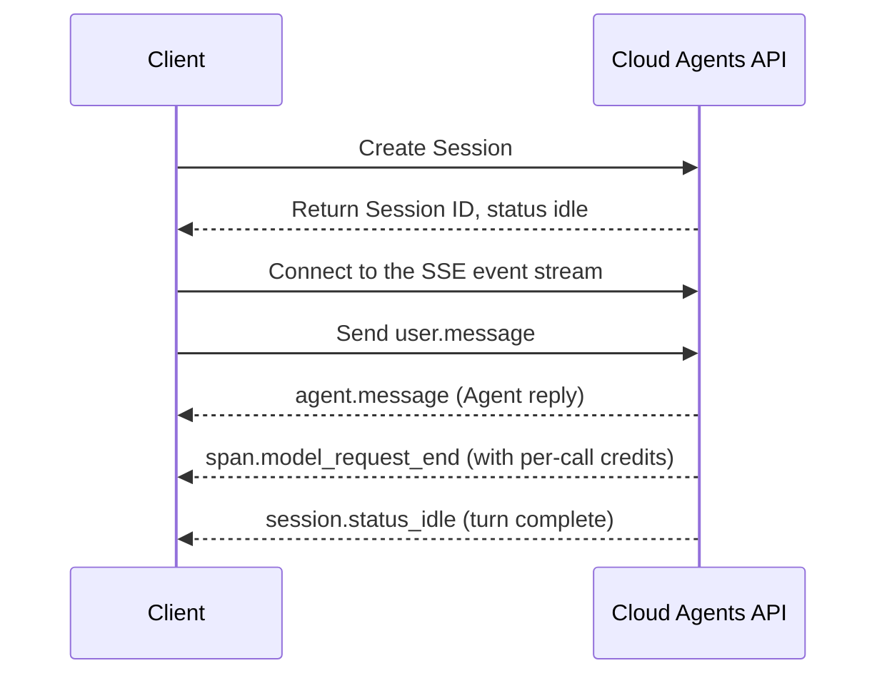

> This language version was automatically translated by AI.

## Goal and use case

This Recipe walks you through the minimal end-to-end loop of Managed Mode with five curl commands: create a Session → send a message → receive the Agent's reply through the event stream → check the Credit cost. In Managed Mode the Agent runs in the Qoder Cloud managed environment, so you only call the API and never maintain the runtime yourself. It suits developers integrating with the Cloud Agents API for the first time.

First, meet the five concepts that recur throughout this article:

| Concept | Description |
|---|---|
| Agent | A reusable Agent configuration: model, system prompt, tools, and skills |
| Environment | The runtime configuration for a Session; in Managed Mode it is hosted by Qoder Cloud |
| Session | A single run instance of an Agent, binding an Agent to an Environment and carrying one conversational task |
| Event | The messages exchanged between you and the Agent: user messages, Agent replies, status changes, and so on |
| Credit | The billing unit, consumed per model call and accumulated in the Session's `usage` |

The overall call sequence is as follows:



Before you start, prepare a PAT, an Agent ID (and version), and a managed Environment ID, and set them as environment variables:

```bash
export QODER_PAT="<your PAT>"
export AGENT_ID="<Agent ID with the agent_ prefix>"
export AGENT_VERSION="<Agent version number>"
export ENVIRONMENT_ID="<Environment ID with the env_ prefix>"
export BASE_URL="https://api.qoder.com/api/v1/cloud"
```

## Steps

### Step 1: Create a Session

After creation the Session is `idle`, waiting for input:

```bash
curl -s -X POST "$BASE_URL/sessions" \
  -H "Authorization: Bearer $QODER_PAT" \
  -H "Content-Type: application/json" \
  -d @- <<EOF
{
  "agent": {"id": "$AGENT_ID", "type": "agent", "version": $AGENT_VERSION},
  "environment_id": "$ENVIRONMENT_ID",
  "title": "Managed Mode Quickstart"
}
EOF
```

Passing `version` explicitly pins the Agent version, avoiding behavior changes caused by Agent updates. Key fields in the response:

```json
{
  "id": "<SESSION_ID>",
  "type": "session",
  "status": "idle",
  "usage": {"total_credits": 0}
}
```

Save the returned Session ID; every later call needs it:

```bash
export SESSION_ID="<returned ID with the sess_ prefix>"
```

### Step 2: Connect to the SSE event stream

The Agent's output does not come back in the response to sending a message; it is pushed through the event stream. Connect to the event stream before sending the message. Run this in the first terminal and keep the connection open:

```bash
curl -s -N "$BASE_URL/sessions/$SESSION_ID/events/stream" \
  -H "Authorization: Bearer $QODER_PAT" \
  -H "Accept: text/event-stream"
```

When reconnecting after a drop, include `Last-Event-ID` in the request header, and the server resumes from after that event.

### Step 3: Send a message

In a second terminal, send a `user.message` event, where `content` is a non-empty array of content blocks:

```bash
curl -s -X POST "$BASE_URL/sessions/$SESSION_ID/events" \
  -H "Authorization: Bearer $QODER_PAT" \
  -H "Content-Type: application/json" \
  -d '{
    "events": [
      {
        "type": "user.message",
        "content": [
          {"type": "text", "text": "Hello, please introduce yourself in one sentence."}
        ]
      }
    ]
  }'
```

An HTTP 200 with `{"data": [...]}` means it was accepted, and the Session moves from `idle` to `running`.

### Step 4: Read the reply and Credit cost from the event stream

Return to the first terminal. The stream also carries status events such as `session.status_running`; the three key events are shown below (excerpted from real output, with IDs redacted):

```text
id: <EVENT_ID>
event: agent.message
data: {"type":"agent.message","content":[{"type":"text","text":"Hello, I am the Hello World Agent, a general-purpose assistant that can research, write code, run commands, and use tools to complete tasks end to end."}]}

id: <EVENT_ID>
event: span.model_request_end
data: {"type":"span.model_request_end","is_error":false,"model_usage":{"credits":4.05}}

id: <EVENT_ID>
event: session.status_idle
data: {"type":"session.status_idle","stop_reason":{"type":"end_turn"}}
```

- `agent.message`: the Agent's message reply; the body is in the `text` of the `content` array.
- `span.model_request_end`: one model call has finished, and `model_usage.credits` is the credits consumed this time (rounded down to at most two decimal places; the field is omitted when the data is unavailable).
- `session.status_idle`: the turn is complete, and `stop_reason.type` of `end_turn` means it finished normally. Only after you see it can you send the next message.

### Step 5: Query the Session's cumulative Credit

You can query the Session-level cumulative usage at any time:

```bash
curl -s "$BASE_URL/sessions/$SESSION_ID" \
  -H "Authorization: Bearer $QODER_PAT"
```

```json
{
  "id": "<SESSION_ID>",
  "status": "idle",
  "usage": {"total_credits": 4.63}
}
```

`usage.total_credits` is a **snapshot, not an increment**: on repeated queries, overwrite your local record with the new value; do not add them up. In testing, the event stream for this turn contained only one span of 4.05 credits, yet the cumulative value was 4.63—span events do not necessarily cover every billed call, so reconcile against `total_credits`.

## Verification

Confirm the loop worked, item by item:

1. Creating the Session returns HTTP 200, `id` has the `sess_` prefix, and `status` is `idle`.
2. Sending the message returns HTTP 200, and the `data` array contains the `user.message` you sent.
3. `agent.message` appears in the event stream and concludes with `session.status_idle` (`stop_reason.type` of `end_turn`).
4. `span.model_request_end` carries `model_usage.credits`; querying the Session again shows `usage.total_credits` greater than `0`.

## Optional: FAQ

**Q: I received HTTP 409 when sending a message?**

The Session is still processing the previous turn (`running`). Wait until `session.status_idle` appears in the event stream before sending the next one, or first call `POST /api/v1/cloud/sessions/{id}/cancel` to interrupt the current turn.

**Q: How do I resume after an SSE drop?**

When reconnecting, pass `Last-Event-ID` (the `id` of the last event received before the drop) in the request header, and the server replays from after that event.

**Q: There is no `model_usage` field in the event?**

The field is omitted when credits data is unavailable. For reconciliation, rely on `usage.total_credits` returned by `GET /api/v1/cloud/sessions/{id}`.
