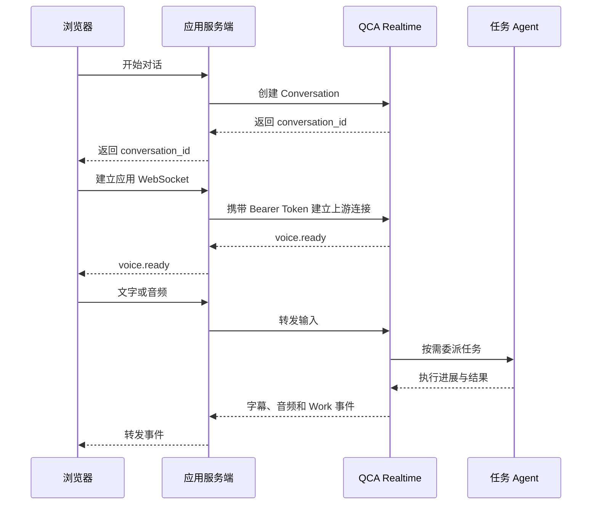

## 目标与适用场景

本文介绍如何为已有 Forward Template 的 Web 应用接入实时语音：

- 语音 Agent 负责交互与结果讲解。
- 任务 Agent 使用 Template 的工具和运行环境执行任务。

| 概念 | 用途 |
| --- | --- |
| Identity | 应用用户在 Forward 中的身份，创建 Conversation 时关联 |
| Template | 任务 Agent 的模型、指令、工具和运行环境配置 |
| Conversation | 可再次连接的语音对话，应用应保存其 ID |
| Work | 对话中委派的后台任务，通过 `work.*` 事件反馈进度与结果 |

浏览器通过应用服务端创建对话、收发实时事件，服务端负责上游鉴权：



开始前准备：

- 凭据与资源：同一环境下的 PAT 或 SAT、Identity、Template；Service Account Key 须先换取 SAT。
- 执行环境：Template 已配置工具权限和运行环境，并能完成目标任务。
- 应用环境：服务端支持 WebSocket，浏览器支持麦克风和 Web Audio，部署页面使用 HTTPS。
- 示例工具：curl 和 Node.js；应用服务端不限语言。

Realtime 处于 Beta。模型、沙箱及工具调用按实际计费规则收费。

## 操作步骤

[官方 Quickstart](https://github.com/QoderAI/forward-quickstart) 提供完整接入示例。

### 第一步：创建 Conversation

由应用服务端创建 Conversation。以下 curl 展示请求格式，将占位值替换为实际凭据和资源 ID：

```bash
export QODER_ACCESS_TOKEN="<PAT 或 SAT>"
export IDENTITY_ID="<Identity ID>"
export TEMPLATE_ID="<Template ID>"
export FORWARD_BASE_URL="https://api.qoder.com.cn/api/v1/forward"
export IDEMPOTENCY_KEY="$(node -e 'console.log(crypto.randomUUID())')"

curl --silent --show-error --fail-with-body \
  -X POST "$FORWARD_BASE_URL/realtime/conversations" \
  -H "Authorization: Bearer $QODER_ACCESS_TOKEN" \
  -H "Content-Type: application/json" \
  -H "Idempotency-Key: $IDEMPOTENCY_KEY" \
  --data @- <<EOF
{
  "identity_id": "$IDENTITY_ID",
  "template_id": "$TEMPLATE_ID",
  "title": "Realtime 接入验证",
  "config": {"audio": {"output": {"voice": "longanqian"}}}
}
EOF
```

Global 环境使用 `https://api.qoder.com/api/v1/forward`，凭据和资源须与环境一致。

成功返回 HTTP 201，响应字段示例：

```json
{
  "id": "conv_xxx",
  "type": "voice.conversation",
  "status": "ready",
  "config": {"audio": {"output": {"voice": "longanqian"}}}
}
```

- 保存返回的 `id`，关联应用用户，后续作为 `conversation_id` 使用。
- 重试同一次创建时，复用幂等键和请求体。
- 音色在创建时固定，更换音色需新建 Conversation。

完整参数见 [创建 Conversation](https://docs.qoder.cn/cloud-agents/forward-realtime-create-conversation)。

### 第二步：建立 WebSocket 连接

服务端连接以下地址，握手请求头携带 `Authorization: Bearer` 凭据：

```text
wss://api.qoder.com.cn/api/v1/forward/realtime?conversation_id=conv_xxx
```

浏览器原生 WebSocket 无法设置 Authorization 请求头。Quickstart 使用同源 `/api/voice/socket` 中继，连接后先发送鉴权消息：

```json
{
  "type": "proxy.auth",
  "pat": "<当前登录的 PAT 或 SAT>",
  "environment": "cn-prod",
  "conversation_id": "conv_xxx"
}
```

- `proxy.auth` 属于 Quickstart 中继协议，由中继处理后连接上游。
- Global 上游域名为 `api.qoder.com`。
- 收到上游的 `voice.ready` 后再发送输入；浏览器的 `open` 仅表示已连上中继。

中继代码见 [voiceProxy.ts](https://github.com/QoderAI/forward-quickstart/blob/339bfc09f307064051161e124fa5d9f1099ec491/server/src/voiceProxy.ts)。

Quickstart 使用开发者凭据登录。面向终端用户的应用需由服务端：

- 管理上游凭据，校验 Conversation 归属。
- 限制允许的 Origin 和上游地址。
- 避免向浏览器下发长期凭据，或将 Token 写入 URL、日志。

### 第三步：发送文字，接收字幕

收到 `voice.ready` 后，以 WebSocket 文本消息发送：

```json
{
  "version": "voice.realtime.v1",
  "type": "text.message",
  "payload": {"text": "你好，请用一句话介绍自己。"}
}
```

- `transcript.delta`：更新临时字幕。
- `transcript.final`：用最终字幕覆盖同一消息的临时字幕。
- `audio.delta`、`audio.done`：接收回复音频，处理方式见下一步。

连接、心跳和重试可参考 Quickstart 的 [VoiceConnection](https://github.com/QoderAI/forward-quickstart/blob/339bfc09f307064051161e124fa5d9f1099ec491/client/src/voice/voiceConnection.ts)。

### 第四步：收发音频

文字交互正常后，接入音频采集和播放。代码见 [voiceAudio.ts](https://github.com/QoderAI/forward-quickstart/blob/339bfc09f307064051161e124fa5d9f1099ec491/client/src/voice/voiceAudio.ts) 和 [useVoiceSession.ts](https://github.com/QoderAI/forward-quickstart/blob/339bfc09f307064051161e124fa5d9f1099ec491/client/src/voice/useVoiceSession.ts)。

| 方向 | 当前格式 | 客户端负责的处理 |
| --- | --- | --- |
| 麦克风输入 | 16 kHz、单声道、PCM16 小端 | 采集后重采样，转成 PCM16，再 Base64 编码 |
| Agent 输出 | 24 kHz、单声道、PCM16 小端 | Base64 解码，转换为 Web Audio 可播放的采样，按顺序排队 |

- 采样格式以 `voice.ready.payload.input_audio`、`output_audio` 为准。
- 发送不含文件头的 PCM 数据，经 Base64 编码后放入 JSON 文本消息。
- 每条客户端消息含 JSON 和 Base64 不超过 256 KiB。

完整协议见 [建立 Conversation 连接](https://docs.qoder.cn/cloud-agents/forward-realtime-connect)。

以下示例复用 Quickstart 的 `MicrophoneCapture`，放在其 `client/src/voice/` 目录下。由开始按钮调用，调用方处理授权失败：

```typescript
import { MicrophoneCapture } from './voiceAudio';
import type { VoiceConnection } from './voiceConnection';

export async function startMicrophone(connection: VoiceConnection) {
  const microphone = new MicrophoneCapture();
  await microphone.start((audio) => {
    if (connection.ready) connection.send('audio.append', { audio });
  });
  return microphone;
}
```

播放与回执按以下顺序处理：

1. 将 `audio.delta` 加入播放队列，开始播放时发送 `playback.started`。
2. 收到 `audio.done` 且队列播放完后，发送 `playback.ended`；取消播放时发送 `playback.cancelled`。
3. 将音频事件携带的 `work_id`、`announcement_id` 原样放入回执 `payload`；均未提供时传 `{}`。

Quickstart 的 `AudioPlayback` 和 `handleVoicePlaybackEvent` 已封装上述逻辑。

### 第五步：执行任务，展示进度

使用已配置代码执行工具和运行环境的 Template，通过语音或 `text.message` 发起任务：

> 请在运行环境中执行 Python，计算 1 到 100 的平方和，告诉我计算结果和你运行的代码。

核对结果 `338350` 及工具执行记录，确认任务确实运行。

按事件顶层的 `work_id` 更新任务状态：

| 事件 | 界面如何更新 |
| --- | --- |
| `work.accepted` | 展示已接受的任务目标 |
| `work.running` | 标记执行中 |
| `work.progress` | 展示工具执行等进展；同时检查是否包含错误 |
| `work.milestone` | 展示阶段性摘要 |
| `work.completed` | 标记完成，展示 `payload.result` |
| `work.failed` | 标记失败或取消，展示 `payload.error.code` |

- 连接状态与任务状态分别维护。
- `work.completed` 表示任务完成，结果播报可能仍在继续。
- 普通对话不一定产生 Work。

### 第六步：管理连接

#### 打断

1. 用户主动打断时，发送 `interrupt`。
2. 停止本地播放、清空队列，并为取消的播报发送 `playback.cancelled`。

收到服务端 `playback.interrupt` 时执行第 2 项。打断播报不会自动取消后台任务。

#### 重连

- 复用原 `conversation_id` 重新鉴权，收到 `voice.ready` 后恢复输入。
- 回读历史恢复界面，不重复发送已提交的任务。`sequence` 在重连后重置，不能用于历史续传。
- 对可重试断线采用退避重试。Quickstart 使用 1、2、4 秒间隔；服务端指定更长等待时间时遵循该时间。
- 鉴权失败、主动结束或收到 `voice.replaced` 后停止重试。

断线期间的音频不保证续播。

#### 结束

1. 停止音频采集和播放。
2. 发送 `connection.close`，携带唯一 `request_id`。
3. 收到匹配的 `connection.closed` 后断开；超时则报错并释放资源。

使用 Quickstart 的当前通话实例：

```typescript
await Promise.allSettled([microphone.stop(), playback.cancel()]);
try {
  await connection.closeGracefully();
} finally {
  connection.disconnect();
}
```

结束通话不会自动取消后台任务，需要时单独取消。

## 验证结果

接入后逐项验证：

| 检查项 | 操作 | 通过标准 |
| --- | --- | --- |
| 创建对话 | 使用同一幂等键和请求体重试创建 | 返回同一个 Conversation ID |
| 连接就绪 | 建立实时连接 | 收到该 Conversation 的 `voice.ready` |
| 文字交互 | 发送一句自我介绍请求 | 收到最终字幕，完整语音界面可播放回复 |
| 语音输入 | 对麦克风说一句话 | 能看到自己的识别文本，并收到回复 |
| 任务执行 | 请求执行平方和计算 | 看到 Work 进展、成功终态及可核对的执行结果 |
| 打断播报 | 播放中点击打断 | 旧音频立即停止，不再播放队列残留 |
| 断线恢复 | 临时断网后恢复 | 复用原 ID 连接并重新就绪，不重复创建任务 |
| 结束通话 | 点击结束 | 收到匹配的关闭确认，麦克风占用解除 |

测试后停止开发服务，清理测试资源。部署后，在实际域名再次验证语音收发与断线恢复。

## 常见问题

### 创建成功，为什么仍然不能发消息？

检查中继与上游连接，确认收到 `voice.ready` 后再发送输入。

### 收到 401 或 403，先检查什么？

检查凭据类型、有效期、所属环境及资源权限。Identity 级 SAT 只能访问对应的 Identity。

### 文字正常，但听不到声音？

检查是否收到 `audio.delta`、解码格式是否正确、AudioContext 是否暂停，以及播放队列和静音设置。

### 为什么语音能回复，却没有执行 Python？

先用普通 Forward 会话验证 Template 的代码执行能力，再检查 Realtime 的 Work 事件和工具执行错误。
