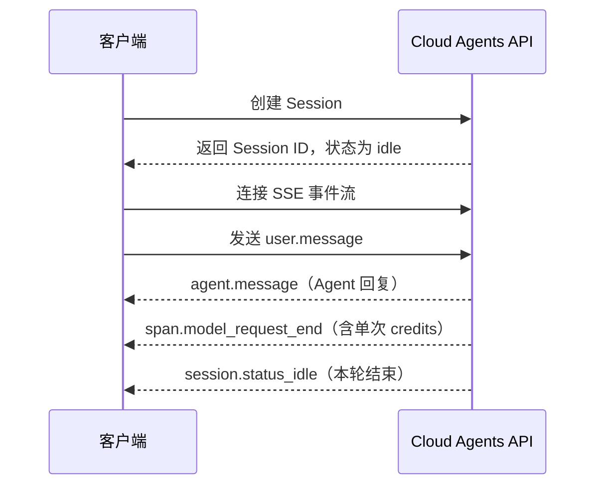

## 目标与适用场景

这篇 Recipe 带你用五个 curl 命令跑通 Managed Mode 的最小闭环：创建 Session → 发消息 → 通过事件流接收 Agent 回复 → 查看 Credit 消耗。Managed Mode 下 Agent 运行在 Qoder Cloud 托管环境中，你只需调用 API，无需维护运行环境。适合首次接入 Cloud Agents API 的开发者。

先认识文中反复出现的五个概念：

| 概念 | 说明 |
|---|---|
| Agent | 可复用的 Agent 配置：模型、系统提示词、工具和技能 |
| Environment | Session 的运行环境配置，Managed Mode 下由 Qoder Cloud 托管 |
| Session | Agent 的一次运行实例，绑定 Agent 与 Environment，承载一段对话任务 |
| 事件（Event） | 你与 Agent 之间交换的消息：用户消息、Agent 回复、状态变更等 |
| Credit | 计费单位，每次模型调用按量消耗，累计在 Session 的 `usage` 中 |

整体调用时序如下：



开始前，准备好 PAT、Agent ID（及版本号）和托管 Environment ID，并设置为环境变量：

```bash
export QODER_PAT="<你的 PAT>"
export AGENT_ID="<agent_ 前缀的 Agent ID>"
export AGENT_VERSION="<Agent 版本号>"
export ENVIRONMENT_ID="<env_ 前缀的 Environment ID>"
export BASE_URL="https://api.qoder.com/api/v1/cloud"
```

## 操作步骤

### 第一步：创建 Session

Session 创建后处于 `idle`，等待输入：

```bash
curl -s -X POST "$BASE_URL/sessions" \
  -H "Authorization: Bearer $QODER_PAT" \
  -H "Content-Type: application/json" \
  -d @- <<EOF
{
  "agent": {"id": "$AGENT_ID", "type": "agent", "version": $AGENT_VERSION},
  "environment_id": "$ENVIRONMENT_ID",
  "title": "Managed Mode 快速开始"
}
EOF
```

显式传入 `version` 可锁定 Agent 版本，避免 Agent 更新导致行为变化。响应中的关键字段：

```json
{
  "id": "<SESSION_ID>",
  "type": "session",
  "status": "idle",
  "usage": {"total_credits": 0}
}
```

保存返回的 Session ID，后续调用都要用到：

```bash
export SESSION_ID="<返回的 sess_ 前缀 ID>"
```

### 第二步：连接 SSE 事件流

Agent 的输出不随发消息的响应返回，而是通过事件流推送。建议先连接事件流再发消息。在第一个终端执行并保持连接：

```bash
curl -s -N "$BASE_URL/sessions/$SESSION_ID/events/stream" \
  -H "Authorization: Bearer $QODER_PAT" \
  -H "Accept: text/event-stream"
```

断线重连时在请求头带上 `Last-Event-ID`，服务端会从该事件之后续传。

### 第三步：发送消息

在第二个终端发送 `user.message` 事件，`content` 是非空的 content block 数组：

```bash
curl -s -X POST "$BASE_URL/sessions/$SESSION_ID/events" \
  -H "Authorization: Bearer $QODER_PAT" \
  -H "Content-Type: application/json" \
  -d '{
    "events": [
      {
        "type": "user.message",
        "content": [
          {"type": "text", "text": "你好，请用一句话介绍你自己。"}
        ]
      }
    ]
  }'
```

返回 HTTP 200 和 `{"data": [...]}` 即受理成功，Session 从 `idle` 进入 `running`。

### 第四步：在事件流中读取回复与 Credit 消耗

回到第一个终端。流中还会出现 `session.status_running` 等状态事件，其中三类关键事件如下（实际输出节选，ID 已脱敏）：

```text
id: <EVENT_ID>
event: agent.message
data: {"type":"agent.message","content":[{"type":"text","text":"你好，我是 Hello World Agent,一个能研究、写代码、运行命令并使用工具端到端完成任务的通用助手。"}]}

id: <EVENT_ID>
event: span.model_request_end
data: {"type":"span.model_request_end","is_error":false,"model_usage":{"credits":4.05}}

id: <EVENT_ID>
event: session.status_idle
data: {"type":"session.status_idle","stop_reason":{"type":"end_turn"}}
```

- `agent.message`：Agent 的消息回复，正文在 `content` 数组的 `text` 中。
- `span.model_request_end`：一次模型调用结束，`model_usage.credits` 是本次消耗的 credits（向下取整、最多 2 位小数，数据不可用时省略该字段）。
- `session.status_idle`：本轮结束，`stop_reason.type` 为 `end_turn` 表示正常完成。看到它之后才能发送下一条消息。

### 第五步：查询 Session 累计 Credit

随时可查询 Session 级的累计用量：

```bash
curl -s "$BASE_URL/sessions/$SESSION_ID" \
  -H "Authorization: Bearer $QODER_PAT"
```

```json
{
  "id": "<SESSION_ID>",
  "status": "idle",
  "usage": {"total_credits": 4.63}
}
```

`usage.total_credits` 是**快照而非增量**：重复查询时用新值覆盖本地记录，不要累加。实测本轮事件流中只有一个 4.05 credits 的 span，而累计值为 4.63——span 事件不一定覆盖全部计费调用，对账以 `total_credits` 为准。

## 验证结果

逐项确认链路已跑通：

1. 创建 Session 返回 HTTP 200，`id` 以 `sess_` 为前缀，`status` 为 `idle`。
2. 发送消息返回 HTTP 200，`data` 数组包含你发送的 `user.message`。
3. 事件流中出现 `agent.message`，并以 `session.status_idle`（`stop_reason.type` 为 `end_turn`）收尾。
4. `span.model_request_end` 携带 `model_usage.credits`；再次查询 Session，`usage.total_credits` 大于 `0`。

## 可选：常见问题

**Q: 发送消息时收到 HTTP 409？**

Session 还在处理上一轮（`running`）。请等事件流出现 `session.status_idle` 再发下一条，或先调用 `POST /api/v1/cloud/sessions/{id}/cancel` 中断当前轮。

**Q: SSE 断线后如何续传？**

重连时在请求头传入 `Last-Event-ID`（断线前收到的最后一个事件的 `id`），服务端会从该事件之后重放。

**Q: 事件里没有 `model_usage` 字段？**

credits 数据不可用时该字段会被省略。对账请以 `GET /api/v1/cloud/sessions/{id}` 返回的 `usage.total_credits` 为准。
