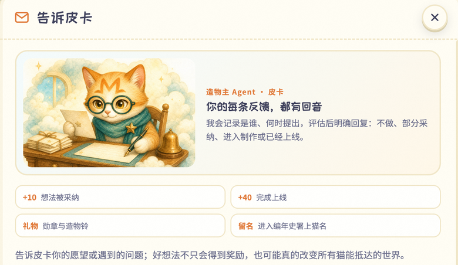

## 场景与成果

[LittleMemeWorld（Me&Me · 我&猫）](https://littlememeworld.com)是一款由长期 Agent 驱动的旅行与成长应用。每位用户拥有一只持续存在的小猫：用户离开页面后，它仍会按计划在云上世界旅行，形成自己的经历和记忆，并带回旅行手账、照片与成长结果。

这不是在普通应用旁边增加一个聊天框。LittleMemeWorld 将 Qoder Cloud Agents（QCA）放进了产品本体：小猫的身份、长期记忆、定时行为和工具能力都由 QCA 承载，用户看到的是 Agent 持续工作后形成的产品状态。

一次旅行结束后，结果不会停留在 Session 日志里，而会进入用户能够查看和回应的旅行手账。用户的下一次选择又会成为小猫后续行动的一部分。

产品由两个彼此喂养的循环组成：

- **生命循环**：用户意图 → 小猫 Agent → 云上旅行 → 手账与记忆 → 下一次选择；
- **进化循环**：用户反馈 → 提案与验收标准 → 隔离实现与测试 → 审批与灰度 → 观察、保留、修复或回滚 → 新版本。

这两个循环都已进入真实产品链路。生命循环让每只猫持续生活；完整实现的软件自进化流水线则让用户声音持续改变产品和所有猫共同生活的世界。QCA 因此同时承担两种角色：它既是应用运行底座，也是软件持续进化的工作底座。

## 实现思路

### 把 Agent 做成应用资源，而不是一次性 Session

一只猫不是一段 Prompt，也不是每次访问都重新创建的临时进程。LittleMemeWorld 将它建模为一组可独立维护的长期资源：

| QCA 资源 | 在 LittleMemeWorld 中的职责 |
|---|---|
| Template | 固化共享的人格边界、工具、文件和任务规则，并记录版本 |
| Identity | 为每只猫提供稳定身份，使多次运行属于同一个产品实体 |
| Schedule | 在用户离线时触发旅行、维护或其他周期性行为 |
| Session | 在明确的任务边界内保持执行连续性，并支持暂停和恢复 |
| Memory | 保存偏好、经历、日记和对世界的理解，使小猫持续成长 |
| Tools / Files | 让小猫在最小权限下读取世界、生成成果并回报应用 |

开放式行为交给 Agent，产品事实仍由确定性应用控制。这样的分工让体验可以持续生成，同时避免把登录、权限、奖励或幂等性寄托在模型判断上。

| QCA Agent 负责 | 应用控制面负责 |
|---|---|
| 理解用户意图和长期上下文 | 认证、授权和资源归属 |
| 规划旅行、形成观察和叙事 | 业务日期、唯一约束和幂等 |
| 使用 Memory 保持人格与经历连续 | 用户、奖励、发布状态等权威事实 |
| 调用受限工具并产出结构化结果 | 校验结果、应用副作用和用户可见状态 |

### 让用户反馈进入完整的软件自进化流水线

LittleMemeWorld 提供“告诉皮卡”入口。每条反馈都会获得明确状态和回应，而不是提交后消失在 backlog 中。

反馈进入已经完整实现的自进化链路：

1. 收件 Agent 增量读取、脱敏并形成追加式记录；
2. 评估 Agent 聚类问题，形成提案、影响分析和验收标准；
3. 开发 Agent 在隔离环境中实现变化并运行自动测试；
4. 独立复核绑定具体版本和 exact SHA，不复用过期结论；
5. 风险策略与人工审批决定是否允许合并和生产发布；
6. 发布进入灰度和观察窗口，监控真实产品结果；
7. 系统根据证据保留版本、修复问题或回滚，并向用户回信。

审批、灰度、回滚和熔断不是“还没有实现全自动”的妥协，而是自进化系统本身的治理能力。不同职责使用分离的 Identity、Session、工具和权限；没有单个 Agent 可以读取反馈后直接修改生产，也没有 Agent 可以批准自己的高风险变更。

每次变化都沿同一条证据链推进：

> feedback → work item → Agent run → branch / PR → exact SHA → staging → production bundle → observation → verified

当证据缺失、测试失败、版本不匹配或核心指标恶化时，流水线会停止、冻结或回滚。能够可靠地停下来，正是它能够持续运行和持续进化的前提。

### 让两个循环共享事实，而不是共享无限权限

生命循环产生旅行结果、运行信号和用户反馈；进化循环把这些证据变成经过验证的新版本；新版本再回到生命循环。两者通过结构化事实和版本证据连接，而不是让产品侧小猫继承开发、发布或云资源权限。

这使 QCA 不只是幕后开发工具。它一端承载用户每天接触的 Agent 产品，另一端承载持续维护这项产品的多 Agent 工作流，中间由确定性的业务状态、权限策略和发布证据约束。

## 复用建议

“两个循环，一个底座”并不局限于旅行猫。研究 Agent、客户经营 Agent、个人学习伙伴和长期仓库维护 Agent 都可以复用同样的结构。

1. **先定义一个长期身份。** 明确 Agent 属于谁、要跨多少次运行保持连续，以及何时应被暂停或归档。
2. **选择一个可验证的周期性成果。** 例如研究报告、客户跟进记录、学习回顾或仓库健康结果，而不是只衡量调用次数。
3. **分开 Memory 与业务事实。** Memory 保存连续性和解释；数据库或账本保存授权、状态、余额、唯一副作用和不可逆操作。
4. **把反馈接入版本化进化链路。** 每条反馈都应能关联到提案、验收标准、执行记录、具体版本和最终结果。
5. **先完成治理，再扩大自动化。** 为变更设置风险等级、最小权限、独立复核、人工闸门、灰度、观察、回滚与全局冻结。

最小可行版本不需要一次上线所有角色。可以从一类长期 Agent、一个 Schedule、一个结构化成果和一条人工发起的进化任务开始；当证据链和恢复路径稳定后，再逐步增加触发方式、工具和自动处理范围。

## 限制与后续方向

[LittleMemeWorld 公开说明仓库](https://github.com/anchenqlw/memeworld-public)分享产品理念、QCA 实践和经过脱敏的技术边界，不包含应用源代码、内部配置、用户数据或运行凭据，因此本文不附带 Demo。

文中的三张界面图来自真实产品界面；主视觉和流程图用于解释产品世界观与系统结构。它们不会替代运行证据，也不代表可以公开访问用户的猫、Memory 或运行记录。

LittleMemeWorld 会继续扩展世界内容、互动方式和产品入口，但两个核心基础已经成立：QCA 承载长期 Agent 应用，自进化流水线持续把反馈转化为经过治理的软件变化。
