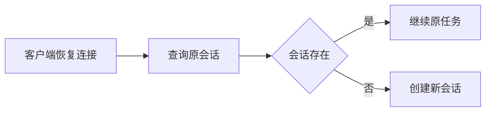

## 目标与适用场景

当客户端暂时断开时，保留服务端会话并重新查询状态，避免重复创建任务。

## 操作步骤

使用占位会话标识查询状态：

```bash
curl "https://api.example.com/sessions/<SESSION_ID>"
```

1. 保存创建接口返回的会话标识。
2. 断线后使用同一标识查询状态。
3. 仅在服务端确认会话不存在时创建新会话。

## 验证结果

确认恢复请求返回原任务状态，并且没有创建重复任务。[^idempotency]

| 检查项 | 预期结果 |
|---|---|
| 原会话 | 状态保持一致 |
| 新任务 | 不会重复创建 |

- [x] 保留会话标识
- [ ] 在测试环境模拟一次断线

下面的流程图说明恢复判断顺序。



[^idempotency]: 重试请求应使用相同的业务标识，避免重复创建任务。
